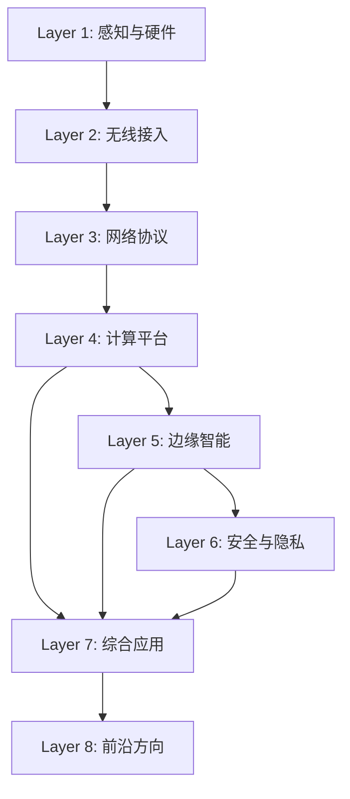

<section class="iot-hero">
  

    
IoT From Zero to Infinity

    <h1>物联网全栈技术学习站</h1>
    

      从传感器到 6G，从零基础到前沿研究。每篇内容用「零基础也能读懂」的方式重写，用自己的话讲明白一个技术方向。
    

    

      <a class="iot-pill" href="roadmap/">学习路线</a>
      <a class="iot-pill iot-pill--secondary" href="progress/">内容进度</a>
    

  

</section>

<!-- content-inventory:start -->
<section class="iot-stats" aria-label="内容基线">
  

    8
    技术层级
  

  

    642
    内容文件
  

  

    200
    显式导航
  

  

    1761
    Plan 条目
  

</section>

## 内容统计

| 层级 | 方向 | 内容文件 |
| --- | --- | ---: |
| Layer 1 | [感知与硬件](foundation/index.md) | 275 |
| Layer 2 | [无线接入](connectivity/index.md) | 217 |
| Layer 3 | [网络协议](network/index.md) | 25 |
| Layer 4 | [计算平台](computing/index.md) | 25 |
| Layer 5 | [边缘智能](intelligence/index.md) | 25 |
| Layer 6 | [安全与隐私](security/index.md) | 25 |
| Layer 7 | [综合应用](applications/index.md) | 25 |
| Layer 8 | [前沿方向](frontier/index.md) | 25 |
| **合计** | | **642** |

> 上表统计的是仓库中的内容文件，不代表来源和技术事实已经审核。显式导航、目录覆盖与扩展计划见[阅读进度](progress.md)。

<!-- content-inventory:end -->

<section class="iot-layers" aria-labelledby="layers-heading">
  

    
Technology Stack

    <h2 id="layers-heading">八层技术全景</h2>
    
从最底层的硬件感知到最前沿的 6G 研究，完整覆盖物联网全栈。

  

  

    <a class="iot-layer-card" href="foundation/">
      
Layer 1

      <h3>感知与硬件</h3>
      
MCU、RTOS、MEMS 传感器、TinyML、能量收集——万物互联的「神经末梢」。

      Content catalog · Sensing & Hardware
    </a>
    <a class="iot-layer-card" href="connectivity/">
      
Layer 2

      <h3>无线接入</h3>
      
BLE、星闪、LoRaWAN、5G RedCap、UWB——让设备开口「说话」。

      Content catalog · Wireless Connectivity
    </a>
    <a class="iot-layer-card" href="network/">
      
Layer 3

      <h3>网络协议</h3>
      
MQTT、CoAP、TSN、DetNet、SDN——数据从端到云的「高速公路」。

      Content catalog · Network Protocols
    </a>
    <a class="iot-layer-card" href="computing/">
      
Layer 4

      <h3>计算平台</h3>
      
边缘计算、Serverless、KubeEdge、任务卸载——离数据最近的「大脑」。

      Content catalog · Edge Computing
    </a>
    <a class="iot-layer-card" href="intelligence/">
      
Layer 5

      <h3>边缘智能</h3>
      
联邦学习、模型压缩、协作推理、NAS——让 AI 在资源受限设备上「思考」。

      Content catalog · Edge Intelligence
    </a>
    <a class="iot-layer-card" href="security/">
      
Layer 6

      <h3>安全与隐私</h3>
      
PUF 认证、TEE、零信任、差分隐私——万物互联的「免疫系统」。

      Content catalog · Security & Privacy
    </a>
    <a class="iot-layer-card" href="applications/">
      
Layer 7

      <h3>综合应用</h3>
      
V2X、数字孪生、智慧农业、工业预测维护——技术落地的「试验田」。

      Content catalog · Applications
    </a>
    <a class="iot-layer-card" href="frontier/">
      
Layer 8

      <h3>前沿方向</h3>
      
6G ISAC、语义通信、量子安全、AIGC 边缘生成——看见「后天」。

      Content catalog · Frontier Research
    </a>
  

</section>

## 这是什么？

一个覆盖物联网全栈技术的中文学习站。每篇内容用“零基础也能读懂”的方式重写，不是翻译，而是用自己的话讲明白一个技术方向。

**适合谁**：对物联网感兴趣的任何人——无论你是刚接触 IoT 的本科生，还是想跨方向了解全景的研究者。

## 技术依赖图

## 如何使用

**如果你是零基础**：从 [Layer 1 感知与硬件](foundation/index.md) 开始，跟着[学习路线](roadmap.md)逐层向上。

**如果你有基础**：直接跳到感兴趣的层级。每层概览页会说明本层主题和建议起点。

**如果你在选研究方向**：先看[内容进度与口径](progress.md)，区分“文件存在”“进入导航”和“来源已审核”。

## 内容质量标准

每篇内容遵循统一生产流程（见仓库根目录 `SOP.md`）：

- 综述报告：目标为完整问题地图、可追溯参考来源和多维对比。
- 论文阅读报告：目标为问题、方法、证据、局限和可复现实验线索。
- 对比分析：至少覆盖三个对比维度，并说明适用边界。

现有内容仍需分层来源审计；“已构建”不能替代“事实已验证”。

<section class="iot-cta">
  <h2>从哪里开始？</h2>
  
零基础从 Layer 1 逐层向上；有基础可以直接进入感兴趣的层级。

  

    <a class="iot-pill" href="roadmap/">查看学习路线</a>
    <a class="iot-pill iot-pill--secondary" href="https://github.com/estelledc/iot" target="_blank" rel="noopener noreferrer">GitHub ↗</a>
  

</section>
