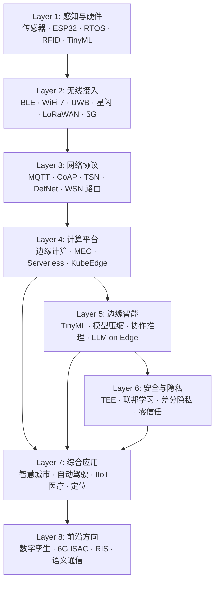

# IoT: From Zero to Infinity

> 物联网全栈技术学习站 —— 从传感器到 6G，从零基础到前沿研究。

---

## 这是什么？

一个覆盖物联网全栈技术的中文学习站。每篇内容用"零基础也能读懂"的方式重写，不是翻译，是用自己的话讲明白一个技术方向。

**适合谁**：对物联网感兴趣的任何人——无论你是刚接触 IoT 的本科生，还是想跨方向了解全景的研究者。

---

## 技术全景图

---

## 内容统计

| 层级 | 方向 | 内容数 | 状态 |
|------|------|--------|------|
| Layer 1 | [感知与硬件](foundation/) | 10 | ✅ |
| Layer 2 | [无线接入](connectivity/) | 10 | ✅ |
| Layer 3 | [网络协议](network/) | 10 | ✅ |
| Layer 4 | [计算平台](computing/) | 10 | ✅ |
| Layer 5 | [边缘智能](intelligence/) | 10 | ✅ |
| Layer 6 | [安全与隐私](security/) | 10 | ✅ |
| Layer 7 | [综合应用](applications/) | 10 | ✅ |
| Layer 8 | [前沿方向](frontier/) | 10 | ✅ |

---

## 如何使用

**如果你是零基础**：从 [Layer 1 感知与硬件](foundation/) 开始，跟着学习路线图逐层向上。

**如果你有基础**：直接跳到感兴趣的层级，每层的概览页会告诉你该层有什么、从哪篇开始读。

**如果你在选论文题目**：看 [阅读进度](progress.md) 页面的选题建议，或者按标签筛选感兴趣的方向。

---

## 内容质量标准

每篇内容遵循统一的生产流程（见 SOP）：

- **综述报告**：≥5000 字，≥15 篇参考文献，≥3 张对比表格
- **论文阅读报告**：≥3000 字，≥10 篇参考文献，含批判性分析
- **对比分析**：≥3 个对比维度，自建对比框架

所有内容均为中文重写（非翻译），包含日常类比、代码示例、踩坑提醒。
