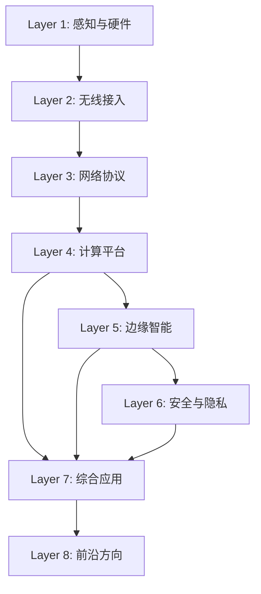

<section class="iot-hero" aria-labelledby="iot-title">
  

    
IoT SYSTEM ATLAS / 8-LAYER LAB

    

      持续维护 · Maintained
      <b>642 / 652</b> HUMAN_APPROVED
      <b>642 / 652</b> SOURCE VERIFIED
    

    <h1 id="iot-title">先看依赖，再选择要深入的 IoT 层。</h1>
    

      这不是 652 篇文章的陈列柜，而是一张可进入、可检查的系统地图。每层同时公开内容规模、上游依赖和审查状态；新增 10 篇保持 <code>UNVERIFIED</code> / <code>UNREVIEWED</code>，旧版 <code>NOT_TRACKED</code> 风险标签也会留在首屏，不被“内容很多”掩盖。
    

    
Explore the stack as a dependency system. Every layer exposes its content volume and evidence state—without presenting review activity as source verification.

    

      <a class="jx-action" href="roadmap/">按依赖开始学习</a>
      <a class="jx-action jx-action--secondary" href="progress/">审查证据与口径</a>
      <a class="jx-action jx-action--secondary" href="https://github.com/estelledc/iot">检查仓库</a>
    

    
<strong>协作边界：</strong>Jason Xun 负责八层体系、里程碑、发布门禁与验收判断；AI 辅助资料研究、内容初稿、批量审查与站点实现，不自行授予 <code>VERIFIED</code> 或 <code>HUMAN_APPROVED</code>。

  

  <aside class="iot-stack-lab" aria-labelledby="stack-lab-title">
    <header class="iot-stack-lab__head">
      
DEPENDENCY MAP<strong id="stack-lab-title">选择一层，沿依赖进入</strong>

      TRUTH MODE · ON
    </header>
    <ol class="iot-stack-map">
      <li><a href="frontier/">L8<strong>前沿方向</strong><small>25 files</small><em>IN_REVIEW</em><b>NOT_TRACKED</b></a></li>
      <li><a href="applications/">L7<strong>综合应用</strong><small>26 files · depends on L4–L6</small><em>MIXED</em><b>1 UNVERIFIED</b></a></li>
      <li><a href="security/">L6<strong>安全与隐私</strong><small>26 files · cross-cutting</small><em>MIXED</em><b>1 UNVERIFIED</b></a></li>
      <li><a href="intelligence/">L5<strong>边缘智能</strong><small>26 files · depends on L4</small><em>MIXED</em><b>1 UNVERIFIED</b></a></li>
      <li><a href="computing/">L4<strong>计算平台</strong><small>25 files · depends on L1–L3</small><em>IN_REVIEW</em><b>NOT_TRACKED</b></a></li>
      <li><a href="network/">L3<strong>网络协议</strong><small>25 files · depends on L2</small><em>IN_REVIEW</em><b>NOT_TRACKED</b></a></li>
      <li><a href="connectivity/">L2<strong>无线接入</strong><small>219 files · depends on L1</small><em>MIXED</em><b>2 UNVERIFIED</b></a></li>
      <li><a href="foundation/">L1<strong>感知与硬件</strong><small>275 files · foundation</small><em>IN_REVIEW</em><b>NOT_TRACKED</b></a></li>
    </ol>
    

      <i data-state="review"></i>正文进入审查
      <i data-state="source"></i>新增卡片未核验；NOT_TRACKED 为历史风险标签
      <a href="architecture/release-policy/">状态如何升级？</a>
    

  </aside>
</section>

<section class="iot-case" id="project-proof" aria-labelledby="project-proof-title">
  <header class="iot-case__header">
    
Project proof

    <h2 id="project-proof-title">先把知识地图做成系统，再讨论规模。</h2>
    
这个项目解决的不是“再写一批 IoT 摘要”，而是让初学者知道技术之间怎样依赖，并让维护者能区分内容存在、可发现、已审查与已验证。

  </header>

  

    

      v0.2.2 · Maintained
      
Markdown 是源真相，MkDocs 是交付面；确定性清单、frontmatter schema、目录生成器、链接检查和 CI 把八层内容组织成可重复构建的学习站。

      
The public value is not raw volume. It is a navigable eight-layer model backed by reproducible inventories, schema checks, generated catalogs, link audits and explicit review states.

      

        
<strong>8</strong>层 IoT 技术体系

        
<strong>652</strong>个内容文件，全部可发现

        
<strong>M1</strong>治理基线已完成

      

      

        <a class="jx-pill" href="progress/">仓库事实与口径</a>
        <a class="jx-pill" href="architecture/release-policy/">发布与验收规则</a>
        <a class="jx-pill" href="content-schema/">内容元数据契约</a>
        <a class="jx-pill" href="https://github.com/estelledc/iot">公开仓库</a>
      

    

    <dl class="jx-proof__meta">
      
<dt>Problem / 问题</dt><dd>IoT 横跨八层，单篇阅读容易失去依赖关系与学习顺序。</dd>

      
<dt>Jason Xun / 决策与验收</dt><dd>定义分层与里程碑，锁定“先治理、再可信、后扩容”，并决定发布是否满足证据门槛。</dd>

      
<dt>AI / 辅助</dt><dd>帮助研究、起草、批量深审和工程实现；自动门禁通过仍不能替代人工验收。</dd>

      
<dt>System / 系统</dt><dd>Markdown → schema 与清单 → catalog 与搜索 → MkDocs Pages；CI 对结构、链接、来源状态和发布规则做回归。</dd>

      
<dt>Evidence / 证据</dt><dd>652 个文件全部进入可发现目录；642/652 正文已有 <code>VERIFIED</code> / <code>HUMAN_APPROVED</code> 投影，新增 10 篇保持初读状态。</dd>

      
<dt>Limitations / 局限</dt><dd class="jx-proof__limitation">全量来源审计仍为当前目标外的待补工作；<code>NOT_TRACKED</code> 是旧版风险标签，新增卡片必须继续走事实核验和人工审查后才能升级。</dd>

    </dl>
  

</section>

<!-- content-inventory:start -->
<section class="iot-stats" aria-label="内容基线">
  

    8
    技术层级
  

  

    657
    内容文件
  

  

    200
    显式导航
  

  

    1761
    Plan 条目
  

</section>

## 内容统计

| 层级 | 方向 | 内容文件 |
| --- | --- | ---: |
| Layer 1 | [感知与硬件](foundation/index.md) | 275 |
| Layer 2 | [无线接入](connectivity/index.md) | 219 |
| Layer 3 | [网络协议](network/index.md) | 25 |
| Layer 4 | [计算平台](computing/index.md) | 25 |
| Layer 5 | [边缘智能](intelligence/index.md) | 34 |
| Layer 6 | [安全与隐私](security/index.md) | 28 |
| Layer 7 | [综合应用](applications/index.md) | 26 |
| Layer 8 | [前沿方向](frontier/index.md) | 25 |
| **合计** | | **657** |

> 上表统计的是仓库中的内容文件，不代表来源和技术事实已经审核。显式导航、目录覆盖与扩展计划见[阅读进度](progress.md)。

<!-- content-inventory:end -->

<section class="iot-layers" aria-labelledby="layers-heading">
  

    
Technology Stack

    <h2 id="layers-heading">八层技术全景</h2>
    
从最底层的硬件感知到最前沿的 6G 研究，完整覆盖物联网全栈。

  

  

    <a class="iot-layer-card" href="foundation/">
      
Layer 1

      <h3>感知与硬件</h3>
      
MCU、RTOS、MEMS 传感器、TinyML、能量收集——万物互联的「神经末梢」。

      Content catalog · Sensing & Hardware
    </a>
    <a class="iot-layer-card" href="connectivity/">
      
Layer 2

      <h3>无线接入</h3>
      
BLE、星闪、LoRaWAN、5G RedCap、UWB——让设备开口「说话」。

      Content catalog · Wireless Connectivity
    </a>
    <a class="iot-layer-card" href="network/">
      
Layer 3

      <h3>网络协议</h3>
      
MQTT、CoAP、TSN、DetNet、SDN——数据从端到云的「高速公路」。

      Content catalog · Network Protocols
    </a>
    <a class="iot-layer-card" href="computing/">
      
Layer 4

      <h3>计算平台</h3>
      
边缘计算、Serverless、KubeEdge、任务卸载——离数据最近的「大脑」。

      Content catalog · Edge Computing
    </a>
    <a class="iot-layer-card" href="intelligence/">
      
Layer 5

      <h3>边缘智能</h3>
      
联邦学习、模型压缩、协作推理、NAS——让 AI 在资源受限设备上「思考」。

      Content catalog · Edge Intelligence
    </a>
    <a class="iot-layer-card" href="security/">
      
Layer 6

      <h3>安全与隐私</h3>
      
PUF 认证、TEE、零信任、差分隐私——万物互联的「免疫系统」。

      Content catalog · Security & Privacy
    </a>
    <a class="iot-layer-card" href="applications/">
      
Layer 7

      <h3>综合应用</h3>
      
V2X、数字孪生、智慧农业、工业预测维护——技术落地的「试验田」。

      Content catalog · Applications
    </a>
    <a class="iot-layer-card" href="frontier/">
      
Layer 8

      <h3>前沿方向</h3>
      
6G ISAC、语义通信、量子安全、AIGC 边缘生成——看见「后天」。

      Content catalog · Frontier Research
    </a>
  

</section>

## 这是什么？

一个覆盖物联网全栈技术的中文学习站。每篇内容用“零基础也能读懂”的方式重写，不是翻译，而是用自己的话讲明白一个技术方向。

**适合谁**：对物联网感兴趣的任何人——无论你是刚接触 IoT 的本科生，还是想跨方向了解全景的研究者。

## 技术依赖图

## 如何使用

**如果你是零基础**：从 [Layer 1 感知与硬件](foundation/index.md) 开始，跟着[学习路线](roadmap.md)逐层向上。

**如果你有基础**：直接跳到感兴趣的层级。每层概览页会说明本层主题和建议起点。

**如果你在选研究方向**：先看[内容进度与口径](progress.md)，区分“文件存在”“进入导航”和“来源已审核”。

## 内容质量标准

每篇内容遵循统一生产流程（见仓库根目录 `SOP.md`）：

- 综述报告：目标为完整问题地图、可追溯参考来源和多维对比。
- 论文阅读报告：目标为问题、方法、证据、局限和可复现实验线索。
- 对比分析：至少覆盖三个对比维度，并说明适用边界。

现有内容仍需分层来源审计；“已构建”不能替代“事实已验证”。

<section class="iot-cta">
  <h2>从哪里开始？</h2>
  
零基础从 Layer 1 逐层向上；有基础可以直接进入感兴趣的层级。

  

    <a class="jx-action" href="roadmap/">查看学习路线</a>
    <a class="jx-action jx-action--secondary" href="https://github.com/estelledc/iot">查看 GitHub</a>
  

</section>
