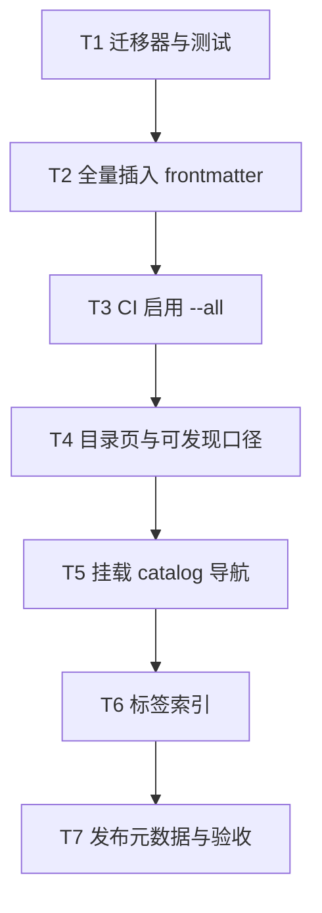

# M1 治理基线 Implementation Plan

> **For agentic workers:** REQUIRED SUB-SKILL: Use superpowers:subagent-driven-development (recommended) or superpowers:executing-plans to implement this plan task-by-task. Steps use checkbox (`- [ ]`) syntax for tracking.

**Goal:** 让全部 642 篇存量内容具备合法 frontmatter、可被站内发现（目录页覆盖孤立页），并把全量 frontmatter 校验与标签索引纳入 CI。

**Architecture:** 机械迁移只在文件顶部插入 YAML，正文字节不变（body SHA-256 断言）。可发现性不靠把 642 篇塞进侧栏，而是每层生成 `catalog.md` 链出全部 `papers/*.md`；清单工具把「可发现」定义为显式导航 ∪ 目录页链接。两篇 legacy mirror 与 canonical 同批写入相同全文，保持现有 SHA-256 门禁。

**Tech Stack:** Python 3.11、PyYAML、jsonschema、MkDocs Material（已有 tags 插件）、现有 `tools/validate_frontmatter.py` / `tools/content_inventory.py` / CI workflows。

**入口条件：** 根目录 `ROADMAP.md` 四里程碑已定；M2–M4 在本计划完成判据全部满足前不得启动。

**完成判据：**

- `python tools/validate_frontmatter.py --all` 通过，且已进入 CI required 步骤
- 清单口径下「内容文件数 = 可发现数」
- 现有内容 URL 不变；`check_duplicates` 对两篇 mirror 仍绿
- 插入前后 body SHA-256 一致

---

## 文件职责表

| 路径 | 职责 |
| --- | --- |
| `tools/migrate_frontmatter.py` | 从路径/H1/难度行提取字段，幂等插入 frontmatter；`--check-body-hash` 断言正文不变 |
| `tests/test_frontmatter_migration.py` | 迁移器单元测试（提取规则、幂等、body hash、禁止非法枚举） |
| `tools/generate_layer_catalogs.py` | 为八层生成/校验 `docs/<layer>/catalog.md` |
| `tools/content_inventory.py` | 增加 `catalog_entries` / `discoverable_entries`；公开块同步 |
| `docs/<layer>/catalog.md` | 自动生成的层级全量目录（可发现入口） |
| `mkdocs.yml` | 每层 nav 增加「全部目录」指向 `catalog.md`；配置 tags 索引 |
| `.github/workflows/ci.yml` / `deploy.yml` | 增加 `validate_frontmatter.py --all` 与 catalog 漂移检查 |
| `docs/content-schema.md` | 去掉「IOT-T010 完成前不把 --all 加入 CI」的过渡说明 |
| `data/canonical-sources.yml` | 不改策略；迁移时同步 mirror 全文 |
| `VERSION` / `CHANGELOG.md` | M1 整包完成后升至 `0.2.0`（minor：目录与门禁能力） |

---

## 任务依赖



---

### Task 1: frontmatter 迁移器 + body SHA 不变断言 (`IOT-T010`)

**Files:**
- Create: `tools/migrate_frontmatter.py`
- Create: `tests/test_frontmatter_migration.py`
- Test: `tests/test_frontmatter_migration.py`
- Reference: `schemas/content-frontmatter.schema.json`, `data/content-enums.yml`, `tools/validate_frontmatter.py`

- [ ] **Step 1: 写失败测试（提取与 body hash）**

在 `tests/test_frontmatter_migration.py` 写入：

```python
from __future__ import annotations

import hashlib
import tempfile
import unittest
from pathlib import Path

from tools import migrate_frontmatter


class MigrateFrontmatterTests(unittest.TestCase):
    def test_extracts_difficulty_and_reading_time_from_blockquote(self) -> None:
        text = (
            "# 传感器节点占空比策略与寿命估算\n\n"
            "> **难度**：🟡 中级 | **领域**：IoT功耗优化 | **阅读时间**：约 18 分钟\n\n"
            "正文第一段。\n"
        )
        meta = migrate_frontmatter.extract_meta(
            path=Path("docs/foundation/papers/duty-cycling-sensor-node.md"),
            text=text,
        )
        self.assertEqual(meta["id"], "duty-cycling-sensor-node")
        self.assertEqual(meta["layer"], 1)
        self.assertEqual(meta["title"], "传感器节点占空比策略与寿命估算")
        self.assertEqual(meta["difficulty"], "intermediate")
        self.assertEqual(meta["reading_time"], 18)
        self.assertEqual(meta["source_status"], "UNVERIFIED")
        self.assertEqual(meta["review_status"], "UNREVIEWED")
        self.assertEqual(meta["content_type"], "UNKNOWN")
        self.assertEqual(meta["prerequisites"], "UNKNOWN")
        self.assertNotIn(meta["source_status"], {"VERIFIED"})
        self.assertNotIn(meta["review_status"], {"HUMAN_APPROVED"})

    def test_insert_preserves_body_sha256(self) -> None:
        original = (
            "# 标题\n\n"
            "> **难度**：🟢 入门 | **领域**：测试 | **阅读时间**：约 10 分钟\n\n"
            "保持不变的正文。\n"
        )
        body_before = migrate_frontmatter.body_bytes(original)
        updated = migrate_frontmatter.insert_frontmatter(
            path=Path("docs/network/papers/demo-topic.md"),
            text=original,
        )
        self.assertTrue(updated.startswith("---\n"))
        self.assertEqual(migrate_frontmatter.body_bytes(updated), body_before)
        self.assertEqual(
            hashlib.sha256(body_before).hexdigest(),
            hashlib.sha256(migrate_frontmatter.body_bytes(updated)).hexdigest(),
        )

    def test_idempotent_second_run_unchanged(self) -> None:
        original = "# 标题\n\n正文。\n"
        once = migrate_frontmatter.insert_frontmatter(
            path=Path("docs/security/papers/demo.md"),
            text=original,
        )
        twice = migrate_frontmatter.insert_frontmatter(
            path=Path("docs/security/papers/demo.md"),
            text=once,
        )
        self.assertEqual(once, twice)


if __name__ == "__main__":
    unittest.main()
```

- [ ] **Step 2: 运行测试确认失败**

Run:

```bash
python -m unittest tests.test_frontmatter_migration -v
```

Expected: `ModuleNotFoundError` 或 `ImportError`（`tools.migrate_frontmatter` 尚不存在）。

- [ ] **Step 3: 实现最小迁移器**

创建 `tools/migrate_frontmatter.py`，核心行为：

```python
#!/usr/bin/env python3
"""Mechanically insert content frontmatter without rewriting article bodies."""

from __future__ import annotations

import argparse
import hashlib
import re
import sys
from pathlib import Path
from typing import Any

import yaml

from tools.validate_frontmatter import LAYER_BY_SLUG, load_schema, validate_file

ROOT = Path(__file__).resolve().parents[1]
FRONTMATTER_RE = re.compile(r"\A---\n.*?\n---\n?", re.DOTALL)
H1_RE = re.compile(r"^#\s+(.+?)\s*$", re.MULTILINE)
META_RE = re.compile(
    r"^\s*>\s*\*\*难度\*\*\s*[：:]\s*(?P<body>.+)$",
    re.MULTILINE,
)
DIFFICULTY_MAP = {
    "零基础": "zero_base",
    "入门": "beginner",
    "初级": "beginner",
    "中级": "intermediate",
    "进阶": "advanced",
    "高级": "advanced",
    "前沿": "frontier",
}
READING_TIME_RE = re.compile(r"阅读时间\s*[：:]\s*约?\s*(\d+)\s*分钟")


def body_bytes(text: str) -> bytes:
    return FRONTMATTER_RE.sub("", text, count=1).encode("utf-8")


def extract_meta(path: Path, text: str) -> dict[str, Any]:
    relative = path.as_posix()
    parts = Path(relative).parts
    layer_slug = parts[1] if len(parts) >= 4 else path.parent.parent.name
    layer = LAYER_BY_SLUG[layer_slug]
    h1 = H1_RE.search(FRONTMATTER_RE.sub("", text, count=1))
    title = h1.group(1).strip() if h1 else path.stem
    difficulty: str | int = "UNKNOWN"
    reading_time: str | int = "UNKNOWN"
    meta_line = META_RE.search(text)
    if meta_line:
        body = meta_line.group("body")
        for label, enum_value in DIFFICULTY_MAP.items():
            if label in body:
                difficulty = enum_value
                break
        time_match = READING_TIME_RE.search(body)
        if time_match:
            reading_time = int(time_match.group(1))
    return {
        "schema_version": "1.0",
        "id": path.stem,
        "title": title,
        "layer": layer,
        "content_type": "UNKNOWN",
        "difficulty": difficulty,
        "reading_time": reading_time,
        "prerequisites": "UNKNOWN",
        "tags": [],
        "source_status": "UNVERIFIED",
        "review_status": "UNREVIEWED",
        "last_reviewed": "UNKNOWN",
    }


def render_frontmatter(meta: dict[str, Any]) -> str:
    dumped = yaml.safe_dump(
        meta,
        allow_unicode=True,
        sort_keys=False,
        default_flow_style=False,
    ).rstrip() + "\n"
    return f"---\n{dumped}---\n"


def insert_frontmatter(path: Path, text: str) -> str:
    if text.startswith("---\n"):
        return text
    meta = extract_meta(path, text)
    return render_frontmatter(meta) + text


def migrate_path(path: Path, *, dry_run: bool = False) -> tuple[bool, str]:
    original = path.read_text(encoding="utf-8")
    before_hash = hashlib.sha256(body_bytes(original)).hexdigest()
    updated = insert_frontmatter(path, original)
    after_hash = hashlib.sha256(body_bytes(updated)).hexdigest()
    if before_hash != after_hash:
        raise ValueError(f"body hash changed for {path}")
    changed = updated != original
    if changed and not dry_run:
        path.write_text(updated, encoding="utf-8")
    return changed, before_hash
```

并实现 CLI：`--all` / `--path` / `--dry-run`；`--all` 结束后对每个已迁移文件调用 `validate_file`（或批量跑 `validate_frontmatter --all`）。

难度映射必须覆盖正文里出现的「初级 / 中级 / 进阶 / 高级 / 前沿 / 入门 / 零基础」。`content_type` 一律 `UNKNOWN`（目录名是 `papers/` 不能推断为 `paper_reading`）。

- [ ] **Step 4: 跑测试确认通过**

Run:

```bash
python -m unittest tests.test_frontmatter_migration -v
```

Expected: `OK`（全部通过）。

- [ ] **Step 5: Commit**

```bash
git add tools/migrate_frontmatter.py tests/test_frontmatter_migration.py
git commit -m "feat(IOT-T010): add mechanical frontmatter migrator with body-hash guard"
```

---

### Task 2: 全量迁移 642 篇 + 同步 2 个 mirror (`IOT-T010`)

**Files:**
- Modify: `docs/*/papers/*.md`（642 篇，仅插入 frontmatter）
- Modify: `papers/edge-computing-survey/index.md`
- Modify: `papers/jupiter/index.md`
- Reference: `data/canonical-sources.yml`

- [ ] **Step 1: dry-run 统计将变更文件数**

Run:

```bash
python tools/migrate_frontmatter.py --all --dry-run
```

Expected: 报告将变更约 642 个内容文件（已有 frontmatter 的为 0，应全部插入）；无 body hash 错误。

- [ ] **Step 2: 执行全量迁移**

Run:

```bash
python tools/migrate_frontmatter.py --all
python tools/validate_frontmatter.py --all
```

Expected: `FRONTMATTER_SCHEMA_OK checked=642 ...`

- [ ] **Step 3: 同步 legacy mirrors**

将 canonical 全文复制到 mirror（保持字节一致）：

```bash
cp docs/computing/papers/edge-computing-survey.md papers/edge-computing-survey/index.md
cp docs/intelligence/papers/jupiter.md papers/jupiter/index.md
python tools/check_duplicates.py
```

Expected: `DUPLICATE_POLICY_OK ... legacy_markdown_mirrors=2`

- [ ] **Step 4: 抽查 body hash 与链接门禁**

Run:

```bash
python tools/check_markdown_fences.py --all
python tools/check_markdown_links.py --all --anchors --strict
python -m unittest discover -s tests -v
```

Expected: 全部通过。若某篇原有 `---` 水平线被误判为 frontmatter，在迁移器中收紧「仅当文件以 `---\n` 开头且存在闭合 `---`」的已迁移检测，并只对真正缺失 frontmatter 的文件插入。

- [ ] **Step 5: Commit**

```bash
git add docs/*/papers/*.md papers/edge-computing-survey/index.md papers/jupiter/index.md
git commit -m "feat(IOT-T010): insert frontmatter for all 642 content files"
```

---

### Task 3: CI 启用全量 frontmatter 校验 (`IOT-T011`)

**Files:**
- Modify: `.github/workflows/ci.yml`
- Modify: `.github/workflows/deploy.yml`
- Modify: `docs/content-schema.md`

- [ ] **Step 1: 把 `--all` 写入 CI / deploy 的验证步骤**

在两个 workflow 中，将：

```yaml
python tools/validate_frontmatter.py --schema-only --fixtures
```

改为（保留 fixtures，并增加全量）：

```yaml
python tools/validate_frontmatter.py --schema-only --fixtures
python tools/validate_frontmatter.py --all
```

- [ ] **Step 2: 更新内容契约文档**

在 `docs/content-schema.md` 的「验证」一节，删除「在 `IOT-T010` 完成前，不把 `--all` 加入 required CI」段落。

保留 `## 验证` 标题，正文改为说明「CI 与 Pages 构建均要求全量内容文件通过 schema + 路径语义校验」，并给出命令：

```bash
python tools/validate_frontmatter.py --schema-only --fixtures
python tools/validate_frontmatter.py --all
```

- [ ] **Step 3: 本地复现 CI 片段**

Run:

```bash
python tools/validate_frontmatter.py --schema-only --fixtures
python tools/validate_frontmatter.py --all
python tools/check_workflow_policy.py
```

Expected: 全部 `*_OK`。

- [ ] **Step 4: Commit**

```bash
git add .github/workflows/ci.yml .github/workflows/deploy.yml docs/content-schema.md
git commit -m "ci(IOT-T011): require validate_frontmatter --all in quality gates"
```

---

### Task 4: 八层 catalog 生成器 + 清单「可发现」口径 (`IOT-T003`)

**Files:**
- Create: `tools/generate_layer_catalogs.py`
- Create: `tests/test_layer_catalogs.py`
- Modify: `tools/content_inventory.py`
- Create: `docs/foundation/catalog.md`（及另外七层，由生成器写出）
- Modify: `data/content-inventory.json`（经 `--write`）
- Modify: 带 `content-inventory` 标记的公开表面（经 `--write`）

- [ ] **Step 1: 写失败测试（catalog 覆盖该层全部 papers）**

```python
from __future__ import annotations

import tempfile
import unittest
from pathlib import Path

from tools import generate_layer_catalogs


class LayerCatalogTests(unittest.TestCase):
    def test_catalog_lists_every_paper(self) -> None:
        with tempfile.TemporaryDirectory() as directory:
            root = Path(directory)
            papers = root / "docs" / "network" / "papers"
            papers.mkdir(parents=True)
            (papers / "a.md").write_text("# A\n", encoding="utf-8")
            (papers / "b.md").write_text("# B\n", encoding="utf-8")
            text = generate_layer_catalogs.render_catalog(
                layer_id=3,
                slug="network",
                name="网络协议",
                paper_paths=[papers / "a.md", papers / "b.md"],
            )
            self.assertIn("](papers/a.md)", text)
            self.assertIn("](papers/b.md)", text)
            self.assertIn("自动生成", text)
```

- [ ] **Step 2: 运行测试确认失败**

Run:

```bash
python -m unittest tests.test_layer_catalogs -v
```

Expected: 因模块不存在而失败。

- [ ] **Step 3: 实现生成器**

`tools/generate_layer_catalogs.py` 要点：

- 复用 `content_inventory.LAYERS`
- 每个 `docs/<slug>/catalog.md` 格式：

```markdown
# Layer N：<中文名> · 全部目录

> 本页由 `python tools/generate_layer_catalogs.py --write` 自动生成；请勿手工编辑链接列表。

| # | 标题 | 文件 |
| --- | --- | --- |
| 1 | <H1 或 stem> | [stem](papers/stem.md) |
```

- CLI：`--write` / `--check`（漂移则非零退出）
- 标题优先取正文 H1（跳过 frontmatter），否则用 stem

- [ ] **Step 4: 扩展 inventory 可发现口径**

在 `tools/content_inventory.py`：

1. 新增 `_catalog_paths(slug) -> set[str]`，解析 `docs/<slug>/catalog.md` 中的 `](papers/....md)` 链接。
2. 每层增加字段：
   - `catalog_entries`
   - `discoverable_entries` = `len(layer_nav_paths ∪ catalog_paths)`（路径统一为 `slug/papers/...`）
3. `totals` 增加对应合计。
4. 在 `_markdown_table` 全量表增加「目录页入口」「可发现」列；更新 README / progress / roadmap 等 renderer，使 `--check` 仍绿。
5. `definitions` 写明：可发现 = 显式导航 ∪ 层级 catalog 链接；不等于来源已审核。

- [ ] **Step 5: 生成并校验**

Run:

```bash
python tools/generate_layer_catalogs.py --write
python tools/content_inventory.py --write
python tools/generate_layer_catalogs.py --check
python tools/content_inventory.py --check
python -m unittest tests.test_layer_catalogs tests.test_quality_tools -v
```

Expected: `discoverable_entries` 合计等于 `content_files`（642）；`--check` 通过。

- [ ] **Step 6: Commit**

```bash
git add tools/generate_layer_catalogs.py tests/test_layer_catalogs.py \
  tools/content_inventory.py docs/*/catalog.md data/content-inventory.json \
  README.md ROADMAP.md reading-progress.md docs/index.md docs/progress.md docs/roadmap.md
git commit -m "feat(IOT-T003): generate layer catalogs and discoverable inventory metric"
```

---

### Task 5: 在 mkdocs 导航挂载各层目录页 (`IOT-T003`)

**Files:**
- Modify: `mkdocs.yml`
- Modify: `.github/workflows/ci.yml`（可选：catalog `--check`）
- Modify: `.github/workflows/deploy.yml`

- [ ] **Step 1: 每层 nav 增加目录入口**

在 `mkdocs.yml` 每一层（`Layer N ...`）的 `index.md` 之后、`论文与综述` 之前插入：

```yaml
    - 全部目录: foundation/catalog.md
```

八层 slug 分别为：`foundation` / `connectivity` / `network` / `computing` / `intelligence` / `security` / `applications` / `frontier`。

**不要**把 442 篇孤立页逐条写入侧栏；精选 25 篇/层的现有列表保持不变。内容文件 URL（`.../papers/<slug>/`）不得改动。

- [ ] **Step 2: CI 增加 catalog 漂移检查**

在 quality / build job 的验证脚本中加入：

```bash
python tools/generate_layer_catalogs.py --check
```

- [ ] **Step 3: 构建与页面断言**

Run:

```bash
mkdocs build --strict --site-dir .tmp/site
python tools/validate_site.py --site-dir .tmp/site --page foundation/catalog/index.html \
  --assert-single-main --assert-single-h1
python tools/check_markdown_links.py --all --anchors --strict
```

Expected: 构建成功；`foundation/catalog/` 可访问；链接检查通过。

- [ ] **Step 4: Commit**

```bash
git add mkdocs.yml .github/workflows/ci.yml .github/workflows/deploy.yml
git commit -m "feat(IOT-T003): expose layer catalog pages in navigation"
```

---

### Task 6: Material tags 索引页 (`IOT-T027`)

**Files:**
- Modify: `mkdocs.yml`
- Create or modify: `docs/tags.md`（若 Material 版本需要显式页）
- Note: 迁移后多数 `tags: []`；索引页先上线为空/稀疏可用状态，不在本任务回填标签正文

- [ ] **Step 1: 配置 tags 插件输出**

确认 `plugins` 含 `tags`。增加：

```yaml
plugins:
  - search:
      lang:
        - zh
        - en
  - tags:
      tags_file: tags.md
```

创建 `docs/tags.md`：

```markdown
# 标签索引

按 frontmatter `tags` 聚合的内容入口。标签在 M1 机械迁移中允许为空；后续人工或受控回填后会自动出现在此页。
```

并在 `mkdocs.yml` 的顶层 nav「维护与质量」附近或「首页」后加入：

```yaml
  - 标签索引: tags.md
```

- [ ] **Step 2: 构建验证**

Run:

```bash
mkdocs build --strict --site-dir .tmp/site
python tools/validate_site.py --site-dir .tmp/site --page tags/index.html \
  --assert-single-main --assert-single-h1
```

Expected: 构建成功；标签页可渲染。

- [ ] **Step 3: Commit**

```bash
git add mkdocs.yml docs/tags.md
git commit -m "feat(IOT-T027): enable Material tags index page"
```

---

### Task 7: 版本、Changelog、公开口径与全量验收

**Files:**
- Modify: `VERSION` → `0.2.0`
- Modify: `CHANGELOG.md`
- Modify: `docs/progress.md`（当前决策：M1 完成，下一步 M2）
- Modify: `ROADMAP.md` M1 完成状态说明（不改 inventory 自动块以外的事实数字源）
- Modify: `README.md` 如需指向目录页/标签页

- [ ] **Step 1: 写 Changelog**

`VERSION` 设为 `0.2.0`。`CHANGELOG.md` 顶部新增：

```markdown
## [0.2.0] - YYYY-MM-DD

### Added

- `IOT-T010` / `IOT-T011`：642 篇 frontmatter 机械迁移；CI 启用 `validate_frontmatter.py --all`；body SHA-256 不变。
- `IOT-T003`：八层 `catalog.md` 自动目录；清单增加可发现口径（导航 ∪ 目录页）。
- `IOT-T027`：Material tags 索引页。

### Review baseline

- Source commit: <40-char sha of pre-change main/base>
- 迁移说明：仅插入 frontmatter 与新增目录/标签页；既有 papers URL 不变。
```

- [ ] **Step 2: 跑与 CI 同构的全部门禁**

```bash
python tools/content_inventory.py --check
python tools/generate_layer_catalogs.py --check
python tools/check_release_metadata.py --version-file VERSION --changelog CHANGELOG.md
python tools/check_duplicates.py
python tools/validate_frontmatter.py --schema-only --fixtures
python tools/validate_frontmatter.py --all
python tools/check_workflow_policy.py
python -m unittest discover -s tests -v
python tools/check_markdown_fences.py --all
python tools/check_markdown_links.py --all --anchors --strict
mkdocs build --strict --site-dir .tmp/site
python tools/validate_site.py --site-dir .tmp/site --page index.html \
  --assert-single-main --assert-single-footer --assert-single-h1 \
  --assert-text "物联网全栈技术学习站" \
  --assert-link "foundation/" --assert-link "connectivity/" \
  --assert-link "network/" --assert-link "computing/" \
  --assert-link "intelligence/" --assert-link "security/" \
  --assert-link "applications/" --assert-link "frontier/" \
  --assert-link "roadmap/" --assert-link "progress/" \
  --external-link-rel
```

Expected: 全部通过；清单中可发现数 = 642。

- [ ] **Step 3: 更新进度页决策**

在 `docs/progress.md`「当前决策」改为：

```markdown
## 当前决策

- M1 治理基线已完成：frontmatter 全量覆盖、八层 catalog 可发现、CI `--all` 启用。
- 下一步进入 M2 可信基线（来源抽样与 review record）；在此之前不启动 Layer 3–8 大批量扩容。
- 实施记录见 [M1 治理基线计划](superpowers/plans/2026-07-10-m1-governance-baseline.md)。
```

- [ ] **Step 4: Commit / push / PR**

```bash
git add VERSION CHANGELOG.md docs/progress.md ROADMAP.md README.md
git commit -m "release: v0.2.0 M1 governance baseline"
git push -u origin HEAD
```

用 `ManagePullRequest` 开 PR；标题建议：`feat: M1 治理基线——frontmatter、目录页与全量校验 (v0.2.0)`。

---

## 明确不做（本计划执行期间）

- 不改正文论述、不重写 URL、不把 642 篇塞进侧栏 nav
- 不自动标记 `VERIFIED` / `HUMAN_APPROVED` / `paper_reading`
- 不启动 M2 来源抽样、M3 扩容流水线、M4 社区功能
- 不批量回填非空 `tags` / `prerequisites`（允许空数组与 `UNKNOWN`，留待后续受控任务）

---

## Spec 覆盖自检

| M1 要求 | 对应任务 |
| --- | --- |
| frontmatter 全量机械迁移 | T1–T2 |
| migration_rules / 禁止 VERIFIED | T1 测试与实现 |
| body 不变 | T1 hash 断言 + T2 验证 |
| legacy mirror 一致 | T2 `cp` + `check_duplicates` |
| 可发现 = 全部内容文件 | T4–T5 catalog + inventory |
| URL 不变 | T5 只加 catalog 入口 |
| `validate_frontmatter --all` 入 CI | T3 |
| 标签索引 | T6 |
| 发布规则 / Changelog | T7 |
