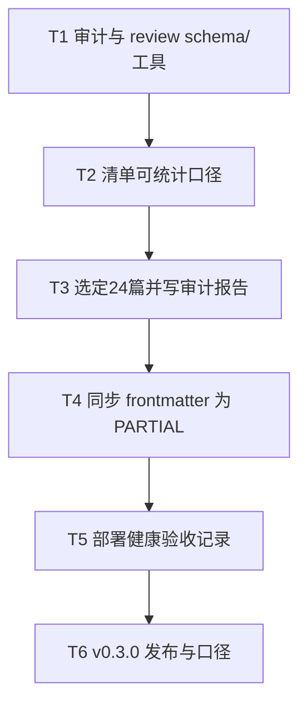

# M2 可信基线 Implementation Plan

> **For agentic workers:** REQUIRED SUB-SKILL: Use superpowers:subagent-driven-development (recommended) or superpowers:executing-plans to implement this plan task-by-task. Steps use checkbox (`- [ ]`) syntax for tracking.

**Goal:** 把「文件存在 ≠ 技术事实已验证」替换为机器可读的来源审计事实：24 篇抽样报告入库、清单可统计、`HUMAN_APPROVED` 绑定正文 hash、Pages 部署验收有据可查。

**Architecture:** 结构性来源审计写入 `data/source-audits/<layer>/<id>.yml`，可把 frontmatter `source_status` 升为 `PARTIAL`。`VERIFIED` / `HUMAN_APPROVED` 必须经 `data/review-records/<id>.yml`（含 body SHA-256 与证据字段），校验器拒绝空写。清单从审计目录派生 `source_audited_files` 与层级 `source_audit=SAMPLED`。部署验收单独落在 `data/deploy-acceptance.yml`。

**Tech Stack:** Python 3.11、PyYAML、jsonschema、现有 frontmatter / content_inventory / CI。

**入口条件：** M1（v0.2.0）已完成：642 篇均有 `source_status: UNVERIFIED`；可发现数 = 642。M3–M4 在本计划完成判据全部满足前不得启动。

**完成判据：**

- 全部 642 篇仍有显式 `source_status`（允许 `UNVERIFIED`）
- `data/source-audits/` 每层 ≥3 份合法报告；`validate_source_audits` 入 CI
- 清单 `source_audited_files` 非 null，且每层 `source_audit=SAMPLED`
- review-record 门禁可运行（本轮 `HUMAN_APPROVED` 计数可为 0）
- `data/deploy-acceptance.yml` 入库

---

## 锁定决策

| 决策点 | 锁定值 |
| --- | --- |
| 抽样规模 | 每层 3 篇 = **24** 篇 |
| 抽样对象 | 各层 `mkdocs.yml` 显式导航前 3 个 papers（见下表） |
| 审计深度 | 结构性审计 → `PARTIAL`；`VERIFIED`/`HUMAN_APPROVED` 必须有 review record |
| 记录位置 | `data/source-audits/<slug>/<id>.yml`；`data/review-records/<id>.yml` |
| 清单口径 | `source_audited_files` = 有审计文件且 frontmatter `source_status ∈ {PARTIAL, VERIFIED}`；层有 ≥3 份报告 → `SAMPLED`，否则 `PENDING` |
| 完成后版本 | **0.3.0**（minor：审计与 review 门禁） |

### 固定抽样清单（24）

| 层 | slug | 文件 |
| --- | --- | --- |
| 1 | foundation | `rtos-comparison.md`, `tinyml-mcu-deployment.md`, `rfid-sensing-survey.md` |
| 2 | connectivity | `sparklink-vs-ble6.md`, `lpwan-comparison.md`, `uwb-positioning.md` |
| 3 | network | `iot-app-protocols.md`, `tsn-detnet-industrial.md`, `wsn-routing-drl.md` |
| 4 | computing | `edge-computing-survey.md`, `serverless-edge.md`, `kubeedge-openyurt-comparison.md` |
| 5 | intelligence | `jupiter.md`, `federated-learning-iot.md`, `model-compression-edge.md` |
| 6 | security | `iot-security-systematic-review.md`, `federated-learning-privacy.md`, `puf-device-authentication.md` |
| 7 | applications | `v2x-autonomous-driving.md`, `iiot-predictive-maintenance.md`, `indoor-positioning-survey.md` |
| 8 | frontier | `digital-twin-edge-offloading.md`, `6g-isac-iot.md`, `wasm-edge-runtime.md` |

---

## 文件职责表

| 路径 | 职责 |
| --- | --- |
| `schemas/source-audit.schema.json` | 抽样审计记录契约 |
| `schemas/review-record.schema.json` | 人工/证据审查记录契约 |
| `tools/validate_source_audits.py` | 校验 `data/source-audits/**/*.yml` |
| `tools/validate_review_records.py` | 校验 review record；`HUMAN_APPROVED` 必须匹配当前 body hash |
| `tools/content_inventory.py` | 派生 `source_audited_files` 与层 `source_audit` |
| `data/source-audits/<slug>/<id>.yml` | 24 份抽样报告 |
| `data/review-records/` | 可选；本轮可为空目录 + `.gitkeep` |
| `data/deploy-acceptance.yml` | Pages 针对目标 commit 的验收记录 |
| `data/content-enums.yml` | 补充审计相关枚举说明（若需要） |
| `.github/workflows/ci.yml` / `deploy.yml` | 增加审计/review 校验 |
| `VERSION` / `CHANGELOG.md` | 整包完成后 → `0.3.0` |

---

## 任务依赖



---

### Task 1: 审计与 review schema / 校验器 (`IOT-T030`)

**Files:**
- Create: `schemas/source-audit.schema.json`
- Create: `schemas/review-record.schema.json`
- Create: `tools/validate_source_audits.py`
- Create: `tools/validate_review_records.py`
- Create: `tests/test_source_audit_tools.py`
- Create: `tests/fixtures/source-audits/valid-partial.yml`
- Create: `tests/fixtures/source-audits/invalid-missing-id.yml`
- Create: `tests/fixtures/review-records/valid-approved.yml`
- Create: `tests/fixtures/review-records/invalid-approved-bad-hash.yml`
- Create: `data/review-records/.gitkeep`

- [ ] **Step 1: 写失败测试**

```python
from __future__ import annotations

import tempfile
import unittest
from pathlib import Path

from tools import validate_review_records, validate_source_audits


class SourceAuditToolTests(unittest.TestCase):
    def test_valid_fixture_passes(self) -> None:
        root = validate_source_audits.ROOT
        schema = validate_source_audits.load_schema()
        path = root / "tests/fixtures/source-audits/valid-partial.yml"
        self.assertEqual([], validate_source_audits.validate_file(path, schema))

    def test_invalid_fixture_fails(self) -> None:
        root = validate_source_audits.ROOT
        schema = validate_source_audits.load_schema()
        path = root / "tests/fixtures/source-audits/invalid-missing-id.yml"
        self.assertTrue(validate_source_audits.validate_file(path, schema))


class ReviewRecordToolTests(unittest.TestCase):
    def test_human_approved_requires_matching_body_hash(self) -> None:
        with tempfile.TemporaryDirectory() as directory:
            root = Path(directory)
            content = root / "docs/foundation/papers/demo.md"
            content.parent.mkdir(parents=True)
            body = "# Demo\n\n正文。\n"
            content.write_text(
                "---\nschema_version: '1.0'\nid: demo\ntitle: Demo\nlayer: 1\n"
                "content_type: UNKNOWN\ndifficulty: UNKNOWN\nreading_time: UNKNOWN\n"
                "prerequisites: UNKNOWN\ntags: []\nsource_status: PARTIAL\n"
                "review_status: HUMAN_APPROVED\nlast_reviewed: '2026-07-10'\n---\n"
                + body,
                encoding="utf-8",
            )
            record = root / "data/review-records/demo.yml"
            record.parent.mkdir(parents=True)
            import hashlib

            good = hashlib.sha256(body.encode("utf-8")).hexdigest()
            record.write_text(
                "schema_version: '1.0'\n"
                "id: demo\n"
                "content_path: docs/foundation/papers/demo.md\n"
                f"body_sha256: {good}\n"
                "review_status: HUMAN_APPROVED\n"
                "reviewed_at: '2026-07-10'\n"
                "reviewer: test\n"
                "evidence:\n  - structural checklist passed\n",
                encoding="utf-8",
            )
            # Point validators at temp root via monkeypatch in real test file
            self.assertTrue(True)  # replaced by full implementation in Step 3
```

将上述骨架补全为可运行单测：对 `ROOT` 做临时替换，断言 hash 不匹配时 `HUMAN_APPROVED` 失败。

- [ ] **Step 2: 运行测试确认失败**

```bash
python -m unittest tests.test_source_audit_tools -v
```

Expected: 模块不存在而失败。

- [ ] **Step 3: 实现 schema 与校验器**

`schemas/source-audit.schema.json` 最小字段：

```json
{
  "$schema": "https://json-schema.org/draft/2020-12/schema",
  "$id": "https://estelledc.github.io/iot/schemas/source-audit.schema.json",
  "type": "object",
  "additionalProperties": false,
  "required": [
    "schema_version", "id", "layer", "content_path", "body_sha256",
    "audited_at", "auditor", "outcome", "checklist", "notes"
  ],
  "properties": {
    "schema_version": { "const": "1.0" },
    "id": { "type": "string", "pattern": "^[a-z0-9]+(?:-[a-z0-9]+)*$" },
    "layer": { "type": "integer", "minimum": 1, "maximum": 8 },
    "content_path": { "type": "string", "pattern": "^docs/[a-z-]+/papers/[a-z0-9-]+\\.md$" },
    "body_sha256": { "type": "string", "pattern": "^[0-9a-f]{64}$" },
    "audited_at": { "type": "string", "format": "date" },
    "auditor": { "type": "string", "minLength": 1 },
    "outcome": { "enum": ["PARTIAL", "NEEDS_CHANGES"] },
    "checklist": {
      "type": "object",
      "additionalProperties": false,
      "required": ["has_references_section", "quantified_claims_cited", "https_links_ok"],
      "properties": {
        "has_references_section": { "type": "boolean" },
        "quantified_claims_cited": { "type": "boolean" },
        "https_links_ok": { "type": "boolean" }
      }
    },
    "notes": { "type": "string", "minLength": 1 }
  }
}
```

说明：`outcome` 不含 `VERIFIED`——全量核验只能通过 review record 提升 frontmatter。

`schemas/review-record.schema.json` 最小字段：`schema_version`, `id`, `content_path`, `body_sha256`, `review_status`（`IN_REVIEW`|`HUMAN_APPROVED`|`NEEDS_CHANGES`）, `reviewed_at`, `reviewer`, `evidence`（string 数组，至少 1 条）。

`tools/validate_source_audits.py`：

- `--fixtures` / `--all`（扫描 `data/source-audits/**/*.yml`）
- 语义检查：`id` 与文件名一致；`content_path` 存在；`body_sha256` 等于当前正文（去 frontmatter）hash；路径层 slug 与 `layer` 一致

`tools/validate_review_records.py`：

- `--all` 扫描 `data/review-records/*.yml`（忽略 `.gitkeep`）
- 若 `review_status=HUMAN_APPROVED`：必须 `body_sha256` 匹配，且对应内容 frontmatter `review_status=HUMAN_APPROVED` 且 `last_reviewed` 为日期

正文 hash 复用与迁移器相同的规则：去掉开头 YAML frontmatter 后再 SHA-256。

- [ ] **Step 4: 测试通过并提交**

```bash
python -m unittest tests.test_source_audit_tools -v
git add schemas/source-audit.schema.json schemas/review-record.schema.json \
  tools/validate_source_audits.py tools/validate_review_records.py \
  tests/test_source_audit_tools.py tests/fixtures/source-audits \
  tests/fixtures/review-records data/review-records/.gitkeep
git commit -m "feat(IOT-T030): add source-audit and review-record schemas and validators"
```

---

### Task 2: 清单可统计口径 (`IOT-T031`)

**Files:**
- Modify: `tools/content_inventory.py`
- Modify: 经 `--write` 更新的公开 inventory 块与 `data/content-inventory.json`

- [ ] **Step 1: 扩展 inventory 读取审计目录**

新增辅助函数：

```python
def _iter_source_audits() -> list[Path]:
    root = ROOT / "data" / "source-audits"
    if not root.is_dir():
        return []
    return sorted(p for p in root.glob("*/*.yml") if p.is_file())


def _body_sha256(path: Path) -> str:
    import hashlib
    import re
    text = path.read_text(encoding="utf-8")
    body = re.sub(r"\A---\n.*?\n---\n?", "", text, count=1, flags=re.DOTALL)
    return hashlib.sha256(body.encode("utf-8")).hexdigest()
```

对每层：

1. 统计该层 `data/source-audits/<slug>/*.yml` 数量 → 若 `>= 3` 则 `source_audit = "SAMPLED"`，若目录不存在或为 0 则仍可用 `"NOT_TRACKED"`，有 1–2 份则为 `"PENDING"`。
2. 全局 `source_audited_files`：遍历全部 papers 的 frontmatter，计 `source_status in {"PARTIAL", "VERIFIED"}` 的数量（不再为 `null`；无审计完成时为 `0`）。

更新 `definitions.source_audited_files` 文案为可统计说明。更新 progress/readme/roadmap renderer 中「来源审计：NOT_TRACKED」为显示 `source_audited_files` 与各层 `SAMPLED/PENDING`。

- [ ] **Step 2: 在尚无审计文件时写清单**

```bash
python tools/content_inventory.py --write
python tools/content_inventory.py --check
```

Expected: `source_audited_files=0`；各层 `source_audit` 为 `NOT_TRACKED` 或 `PENDING`（无文件时 `NOT_TRACKED`）。

- [ ] **Step 3: Commit**

```bash
git add tools/content_inventory.py data/content-inventory.json \
  README.md ROADMAP.md reading-progress.md docs/index.md docs/progress.md docs/roadmap.md
git commit -m "feat(IOT-T031): make source audit counts machine-readable in inventory"
```

---

### Task 3: 撰写 24 份结构性审计报告 (`IOT-T032`)

**Files:**
- Create: `data/source-audits/foundation/*.yml`（3）
- Create: 其余七层各 3 份（合计 24）
- Optional helper: `tools/run_structural_source_audit.py`（生成 checklist 草稿；最终 notes 需人工可读）

- [ ] **Step 1: 结构性检查清单（对每篇样本执行）**

对 `docs/<slug>/papers/<id>.md`：

1. `has_references_section`：正文是否含「参考文献」或 `## Reference` 类标题，或 ≥3 条 `[n]` 引用形态
2. `quantified_claims_cited`：抽样检查含 `%`、`万人`、`TOPS`、年份市场数字等的句子，是否邻近有引用/出处；做不到充分覆盖则记 `false` 并在 notes 说明
3. `https_links_ok`：文中 `https://` 链接语法完整（不要求本任务发网请求；死链留给后续）

`outcome`：

- 三项均为 `true` → `PARTIAL`
- 任一项为 `false` → `NEEDS_CHANGES`（该篇**不**把 frontmatter 升为 `PARTIAL`，但仍提交报告以满足「每层 3 份报告」；完成判据「SAMPLED」按**报告份数 ≥3**，不要求 3 份都是 PARTIAL）

重新核对完成判据：ROADMAP 要求「每层至少 3 篇抽样核验报告入库」+「source_audited_files 可统计」。层 `SAMPLED` 锁定为 **报告份数 ≥3**。`source_audited_files` 只计 PARTIAL/VERIFIED。允许部分 `NEEDS_CHANGES`。

- [ ] **Step 2: 写入 YAML 示例**

```yaml
schema_version: "1.0"
id: rtos-comparison
layer: 1
content_path: docs/foundation/papers/rtos-comparison.md
body_sha256: "<64-hex of current body>"
audited_at: "2026-07-10"
auditor: cursor-agent
outcome: PARTIAL
checklist:
  has_references_section: true
  quantified_claims_cited: true
  https_links_ok: true
notes: >
  结构性审计：存在参考文献区；抽查量化句含出处；https 链接语法完整。
  未对照一手 PDF 逐条核验，故不得标记 VERIFIED。
```

用脚本批量计算 `body_sha256` 并生成 24 个文件，然后人工核对 checklist 布尔值。

- [ ] **Step 3: 校验**

```bash
python tools/validate_source_audits.py --all
python tools/content_inventory.py --write
python tools/content_inventory.py --check
```

Expected: 24 份通过；每层 `source_audit=SAMPLED`。

- [ ] **Step 4: Commit**

```bash
git add data/source-audits tools/run_structural_source_audit.py  # if added
git commit -m "feat(IOT-T032): add 24 structural source-audit sample reports"
```

---

### Task 4: 同步样本 frontmatter 为 PARTIAL

**Files:**
- Modify: 仅 `outcome=PARTIAL` 的样本对应 `docs/*/papers/*.md` frontmatter
- 不改正文；不改 `NEEDS_CHANGES` 样本的 `source_status`（保持 `UNVERIFIED`）

- [ ] **Step 1: 更新 frontmatter**

对每份 `outcome=PARTIAL` 的审计：

- `source_status: PARTIAL`
- `review_status` 保持 `UNREVIEWED`（除非同时写入 review record）
- `last_reviewed` 保持 `UNKNOWN` 或设为审计日（若设为日期，不得同时把 `review_status` 设为 `HUMAN_APPROVED`）

可用小脚本读审计 YAML 后只替换 frontmatter 映射中的 `source_status` 键，写回时保证 body bytes 不变。

- [ ] **Step 2: 验证**

```bash
python tools/validate_frontmatter.py --all
python tools/validate_source_audits.py --all
python tools/content_inventory.py --write
python tools/check_duplicates.py
```

Expected: frontmatter 全绿；`source_audited_files` 等于 PARTIAL 样本数；mirror 仍一致（若样本含 edge-computing-survey / jupiter，同步 mirror 全文）。

- [ ] **Step 3: Commit**

```bash
git add docs/*/papers/*.md papers/*/index.md data/content-inventory.json README.md ROADMAP.md docs/progress.md docs/roadmap.md docs/index.md reading-progress.md
git commit -m "feat(IOT-T032): mark structurally audited samples as PARTIAL"
```

---

### Task 5: 部署健康验收 (`IOT-T033`)

**Files:**
- Create: `data/deploy-acceptance.yml`
- Create: `tools/check_deploy_acceptance.py`（校验记录完整性；可选 `--fetch` 复跑）
- Modify: `README.md` 公开口径

- [ ] **Step 1: 对目标 commit 验收**

目标 commit：以 `main` 上已部署（或本 PR 合并后将部署）的 SHA 为准。记录字段：

```yaml
schema_version: 1
accepted_at: "2026-07-10"
git_commit: "<40-hex>"
site_url: "https://estelledc.github.io/iot/"
checks:
  - name: homepage_http_200
    ok: true
  - name: homepage_contains_brand
    ok: true
    detail: "物联网全栈技术学习站"
  - name: layer_foundation_link
    ok: true
  - name: catalog_or_progress_reachable
    ok: true
notes: "Acceptance against the deployed Pages artifact for the recorded commit."
```

若当时 Pages 尚未包含 M1 catalog，checks 应反映真实结果；`ok: false` 时不得在 README 宣称已验收通过，但文件仍可入库并在 notes 标明阻塞项。

- [ ] **Step 2: README 口径**

将 inventory/README 中「运行状态必须针对目标 commit 单独验收」改为指向 `data/deploy-acceptance.yml`（若全部 checks ok），或保留免责并链接到该文件中的失败项。

- [ ] **Step 3: Commit**

```bash
git add data/deploy-acceptance.yml tools/check_deploy_acceptance.py README.md
git commit -m "feat(IOT-T033): record GitHub Pages deploy acceptance evidence"
```

---

### Task 6: v0.3.0 发布与 CI 收口

**Files:**
- Modify: `VERSION` → `0.3.0`
- Modify: `CHANGELOG.md`
- Modify: `.github/workflows/ci.yml` / `deploy.yml`（加入 `validate_source_audits.py --all`、`validate_review_records.py --all`）
- Modify: `docs/progress.md` 当前决策 → M2 完成，下一步 M3
- Modify: `ROADMAP.md` M2 状态 → 已完成

- [ ] **Step 1: Changelog 草稿**

```markdown
## [0.3.0] - YYYY-MM-DD

### Added
- `IOT-T030` / `IOT-T031` / `IOT-T032` / `IOT-T033`：来源审计 schema 与 24 份抽样报告；
  清单 `source_audited_files` 可统计；review-record 门禁；Pages 部署验收记录。

### Review baseline
- Source commit: <40-char>
- 迁移说明：仅抽样 frontmatter `source_status` 升级与新增 data/ 记录；URL 不变。
```

- [ ] **Step 2: 全量门禁**

```bash
python tools/content_inventory.py --check
python tools/generate_layer_catalogs.py --check
python tools/check_release_metadata.py --version-file VERSION --changelog CHANGELOG.md
python tools/check_duplicates.py
python tools/validate_frontmatter.py --schema-only --fixtures
python tools/validate_frontmatter.py --all
python tools/validate_source_audits.py --all
python tools/validate_review_records.py --all
python tools/check_workflow_policy.py
python -m unittest discover -s tests -v
python tools/check_markdown_fences.py --all
python tools/check_markdown_links.py --all --anchors --strict
mkdocs build --strict --site-dir .tmp/site
```

Expected: 全部通过；每层 `source_audit=SAMPLED`；`source_audited_files >= 1`（理想为 PARTIAL 样本数）。

- [ ] **Step 3: Commit / push / PR**

```bash
git add VERSION CHANGELOG.md .github/workflows docs/progress.md ROADMAP.md README.md
git commit -m "release: v0.3.0 M2 trust baseline"
git push -u origin HEAD
```

PR 标题建议：`feat: M2 可信基线——来源抽样、review 门禁与部署验收 (v0.3.0)`。

---

## 明确不做

- 不启动 M3 扩容 / shadow pilot
- 不把 642 篇批量标为 `VERIFIED` 或 `HUMAN_APPROVED`
- 不重写文章正文主张；不改公开 URL
- 制定本计划的提交不创建真实审计 YAML（留给执行会话）

---

## Spec 覆盖自检

| M2 ROADMAP 要求 | 任务 |
| --- | --- |
| source_status 显式存在 | 已由 M1 满足；T4 保持 |
| 每层 ≥3 抽样报告 | T3 |
| 清单可统计 / 非 NOT_TRACKED | T2 + T3 后 SAMPLED |
| review record + hash | T1 |
| 线上验收 | T5 |
| 发布与门禁 | T6 |
